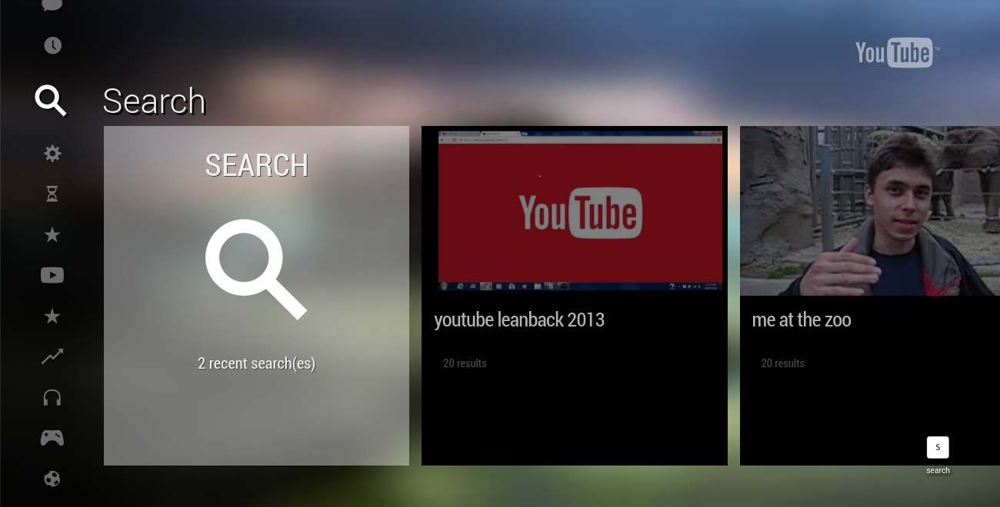
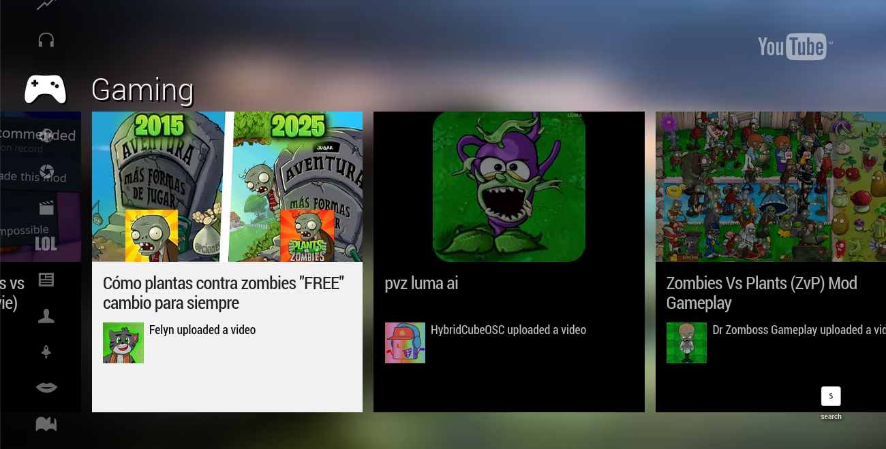
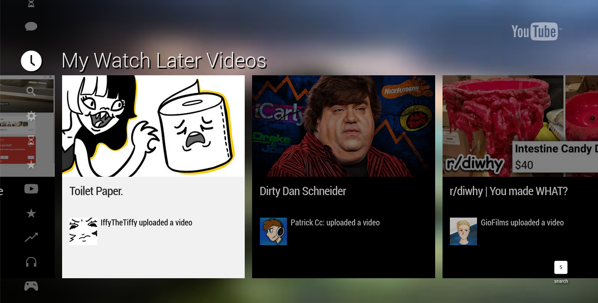
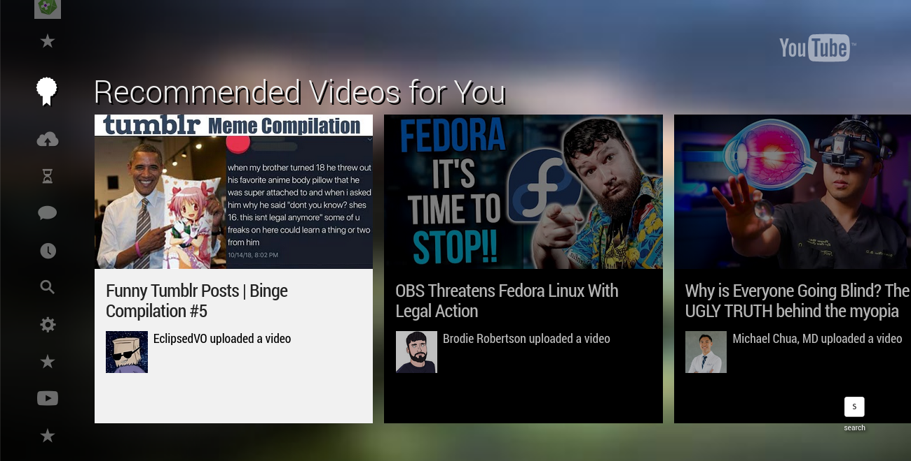

# 2013YouTubeTV

A project to revive the old 2012-2014 YouTubeTV HTML5 Web App.

## Screenshots

**[Note These Are As Of The 11th Of February At 2:15 EST, Things Will Have Changed]**








## Credits

- YouTube/Google

- Erie Valley Software/Erievs

- youtube-dl-exec [https://github.com/microlinkhq/youtube-dl-exec] 

- cors-anywhere [https://github.com/Rob--W/cors-anywhere?tab=readme-ov-file]

- qr-code [https://www.npmjs.com/package/qrcode]

- xml2js [https://github.com/Leonidas-from-XIV/node-xml2js]

- dx for his knowlage 

- Retrofoxxo for his private exsiting project which has a lot of the data I needed.

## Before Posting An Issue!

- Do not hide your damn local ip adress, I have no idea why SO many people
do not know that a 192.168.1.blank or equivlient is not your public IP. I
cannot help you if you're hiding part of your screen.

- Do not report an issue if you modified the port or adress you're hosting this on
, you're on your own if you wanna host it on a different port.

## If You're Going To Host This

PLEASE disable Oauth, so just delete refrences to it in server.js, why 
because this is designed for someone to host themeselves and only themeselves
so I save your token/refresh token in a .json file.

## Things To Know

If you wanna add/change channels check in leanback_ajax. You'll need to also
change "function ug(a, b, c) {" for the thumbnail to load.

Make sure it is UU + (your channel id), it HATES it if it is not.

```
{
    "gdata_url": "http://gdata.youtube.com/feeds/api/users/Y30JRSgfhYXA6i6xX1erWg/uploads",
    "title": "Smosh",
    "tab": "featured",
    "gdata_list_id": "UUY30JRSgfhYXA6i6xX1erWg", /* take this in mind sadly because of youtube chnaged you'll need to
        use this in an if statmment if(a == "yourid") and return the thumbnail image. Check in       function ug(a, b, c) {,
        yeah youtube doesn't let you get it anymore easily*/ 
    "thumbnail": "http://i1.ytimg.com/vi/1b1loWJfxaA/hqdefault.jpg"
},
{
    "gdata_url": "http://gdata.youtube.com/feeds/api/users/aBf1a-dpIsw8OxqH4ki2Kg/uploads",
    "title": "Geek & Sundry",
    "tab": "featured",/* take this in mind sadly because of youtube chnaged you'll need to
    use this in an if statmment if(a == "yourid") and return the thumbnail image. Check in       function ug(a, b, c) {,
    yeah youtube doesn't let you get it anymore easily*/ 
    "gdata_list_id": "UUaBf1a-dpIsw8OxqH4ki2Kg"
},
```


So To Fix The Thumbnail just add or replace an if statment, the if statment checks for gdata_list_id,
so just return your profile url like return "url".

You have to do this because YouTube changed how profiles pictures are handled you cannot just create a URL easily
like with thumbnails, I have no idea why they did that but oh well.


(this ignores the UU from each id so make sure to remove it from the if)

```
function ug(a, b, c) {
    if (a.indexOf("yt3.ggpht.com") !== -1) {
        return a;  
    }

    if (a == "aBf1a-dpIsw8OxqH4ki2Kg") {
        return APP_URL + "/assets/channels4_profile_smosh.jpg";  
    }

    if (a == "aBf1a-dpIsw8OxqH4ki2Kg") {
     return APP_URL + "/assets/channels4_profile_geek.jpg";  
    }

    var e = 0;
    for (var f = 0; f < a.length; ++f) {
        e = 31 * e + a.charCodeAt(f);
        e %= 4294967296;
    }

    return "//i" + (e % 4 + 1) + ".ytimg.com/" + b + "/" + a + "/" + c + ".jpg";
}
```

## Why We Use "youtube-dl-exec"

This is so we can get video urls, without having to deal with all the chiper bs you have
to deal with no  ** you will now need python3.7 or higher installed! though **

## Why We Use "qr-code"

Just to make qr codes for the google chart api implementation.

## Why We Use "node-xml2js"

For XML stuff, it is only in the ratings API though.

## Why We Use "cors-anywhere"

YouTube has CORS on their googlevideo links (I forgot which settings) and it will 
give a CORS error if you try to get it, luckly this exsits so googlevideo links
are all going to be filtered through port 8070!

## Info On Hosting

Right now we use localhost, I think I will change this at some point when I am done 
with finishing the app. Probbaly what YT2009 does, where you input your IP adress you
wanna use. 

I mean YOU can now but you'll have to modify each refrence of localhost to your IP adress,
I just used localhsot as it was easy to setup.

Disable Oauth for now, you won't need to in the future since i can just get your access 
token from the headers (I didn't think about that).

We Use:

- Port 8090

- Port 8070 

## Supported YouTube TV Clients

We only offically supprort 4.20130311 as of right now, however it seems like 2012 builds
should run fine

## Setup

**[Note This Project Isn't Done, So Guide Won't Be Super Great]**

[Make sure you have nodejs, npm, and python3 (version 3.7.something or above!)]

- Step 1: run git clone https://github.com/erievs/2013YouTubeTV.git

- Step 2: run npm install

- Step 3: if you run into issues with youtube-exec, try running "npm install youtube-dl-exec --save"

- Step 4: if you want to set a custom server adress, such as your local ip adress, run 2013youtubesetup.js (it is in the root of the project), it'll display it for you.

- Step 5: run npm start, and you're done!

[When I say V, I mean the version of the YouTube App]

[Note this is not super accurate as I sometimes forget to 
change it, and this is copied and changed from 2016YouTubeTV]

Progress Report

1. Search - 90% Done

    Status: Fetches from YouTube and has all the feilds you need.
    Next Steps: Add conutiration support and such.

3. Browse/Channels/Stantered Feeds/ - 90% Done

    Status: Pretty much all ostatndered feeds are done.
    Next Steps: Fix missing data.

4a. Watch - 75% Done

    Status: Playing videos and gets the data it needs for the info, and realated videos..
    Next Steps: Implemete aurthor channel videos feed.

4b. Watch Interactions - 0% Done

    Status: Nothing.
    Next Steps: Get it working.

5. Pairing - 35% Done

    Status: It generates a code but doesn't bind.
    Next Steps: Figure out why it aint binding.

6. Sign In - 65% Done

    Status: You can sign in and a majority of feeds are implemted.
    Next Steps: See if I can fix the activity (idk) and some other feeds.

7. Assets - 80% Done

    Status: Should have most of em idk.
    Next Steps: Find missing assets and add them, also find as many BGs as I can find (rn we are at 45/115).

8. Other


- Support other versions of YouTube TV [In Progress]

- Other languages

- Fix grammar


